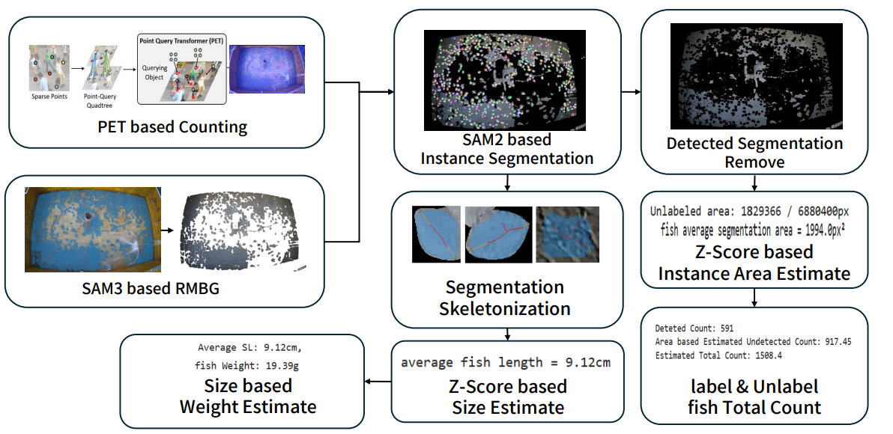

# 도다리 평균 체장·체중·마릿수 추정 파이프라인

이 저장소의 세 스크립트를 순서대로 실행하면, 사육수조 영상의 한 프레임에서
① 도다리 point 검출(PET) → ② 배경/바닥 영역 검출(SAM3) → ③ 개체별 segmentation
및 통계 산출(SAM2) 을 거쳐 **평균 체장(cm), 평균 체중(g), 추정 총 마릿수**를
얻습니다.

```
sam3_patch_pipeline.py (sam3/sam3)
        │  1) 영상 -> 대표 프레임 추출(median+sharpen)
        │  2) SAM3 텍스트 프롬프트로 바닥/배경 검출
        │  3) 검출 안 된 부분(물고기 등) 투명 처리 -> kept_only_frame_*.png
        ▼
PET_inference_pipline.py (PET)
        │  sharpened_frame_*.png 위에서 물고기 point(위치) 검출
        │  -> pred_labels/sharpened_frame_*.txt (YOLO 스타일 point 라벨)
        ▼
fish_segmentation_pipeline.py (sam2)
        │  kept_only_frame_*.png + point 라벨로 개체별 SAM2 segmentation
        │  -> 평균 체장 / 평균 면적 / 추정 총 마릿수 / 평균 체중 출력
        ▼
      최종 결과 (콘솔 출력)
```
# 아키텍처
## 


## 0. 폴더 구조 전제

세 스크립트 모두 아래처럼 `PET`, `sam3`, `sam2`가 같은 상위 폴더(`<BASE_DIR>`)
아래 형제 폴더로 있고, 각 스크립트는 자기 저장소 폴더 안에 있다고 가정합니다.
(`fish_segmentation_pipeline.py`는 이 배치를 기준으로 경로를 자동 계산합니다.)

```
<BASE_DIR>/
├── PET/                                     <- PET point 검출 repo
│   ├── models/, util/ ...                   (PET repo 코드)
│   ├── outputs/Oliver_Flounder/pet_model/best_checkpoint.pth
│   └── PET_inference_pipline.py
├── sam3/
│   ├── assets/bpe_simple_vocab_16e6.txt.gz
│   └── sam3/                                <- sam3 repo, 실행 위치
│       └── sam3_patch_pipeline.py
└── sam2/                                    <- sam2 repo, 실행 위치
    ├── checkpoints/sam2.1_hiera_large.pt
    └── fish_segmentation_pipeline.py
```

## 1. 사전 준비 체크리스트

실행 전에 아래 항목을 확인하세요.

| 항목 | 위치 | 확인 내용 |
|---|---|---|
| 원본 영상 | `sam3_patch_pipeline.py`의 `video_path` | 실제 영상 파일의 절대경로로 수정 (기본값은 예시 경로) |
| SAM3 BPE vocab | `sam3/assets/bpe_simple_vocab_16e6.txt.gz` | 파일이 실제로 존재해야 함 (없으면 `build_sam3_image_model` 단계에서 `FileNotFoundError`) |
| SAM3 패키지 | `sam3/` | sam3 폴더에 접근하여 requirements.txt 실행하여 패키지 설치
| PET 체크포인트 | `PET/outputs/Oliver_Flounder/pet_model/best_checkpoint.pth` | 파일 존재 확인 |
| PET 패키지 | PET 폴더에 접근하여 requirements.txt 실행하여 패키지 설치
| SAM2 체크포인트 | `sam2/checkpoints/sam2.1_hiera_large.pt` | 파일 존재 확인 |
| SAM2 패키지 | `sam2/` | sam2 폴더에 접근하여 requirements.txt 실행하여 패키지 설치
| 추가 패키지 | 공통 | add_requiremtns.txt 실행하여 추가 패키지 설치


세 스크립트는 모두 **frame_idx = 500** 을 기준으로 동작하도록 맞춰져 있습니다.
다른 프레임을 쓰려면 세 파일에서 `frame_idx`(또는 파일명에 박힌 `500`)를 전부
동일하게 바꿔야 합니다.

## 2. 실행 순서

### STEP 1 — SAM3: 대표 프레임 추출 + 배경(바닥) 검출

```bash
cd <BASE_DIR>/sam3/sam3
python sam3_patch_pipeline.py
```

이 스크립트는 파일 안에서 `# %%`로 구분된 3단계를 순서대로 전부 실행합니다.

- **STEP 0**: SAM3 모델 로드
- **STEP 1**: `video_path` 영상에서 `frame_idx`(기본 500) 기준 1초 구간의
  중앙값(median) 프레임을 만들고 샤프닝 적용 →
  `median_frame_500.png`, `sharpened_frame_500.png` 저장
- **STEP 2**: `sharpened_frame_500.png`를 겹치는 패치로 나눠 SAM3 텍스트
  프롬프트(`prompt_configs`, 기본 `"grey rock"`)로 바닥/배경 영역 검출 →
  결과 시각화 `frame_500_patched_multi_prompt.jpg` 저장
- **STEP 3**: STEP 2에서 검출된 영역만 남기고 나머지(물고기 등)는 투명 처리 →
  `inference/kept_only_frame_500.png` 저장

> 이 단계에서는 이미지 크롭을 하지 않습니다(`CROP_LEFT_RIGHT=0`,
> `CROP_BOTTOM=0`로 설정되어 있음). 즉 `kept_only_frame_500.png`는 원본
> 해상도(3840x2160) 그대로입니다. 크롭 정렬은 STEP 2, 3에서 처리합니다.

**이 단계의 결과물**:
- `sam3/sam3/sharpened_frame_500.png` (다음 STEP 2의 입력)
- `sam3/sam3/inference/kept_only_frame_500.png` (STEP 3의 입력)

### STEP 2 — PET: 물고기 point(위치) 검출

`PET_inference_pipline.py`는 이미지 경로가 `./sharpened_frame_500.png`로
하드코딩되어 있으므로, STEP 1에서 만든 파일을 PET 폴더로 복사해야 합니다.

```bash
cp <BASE_DIR>/sam3/sam3/sharpened_frame_500.png <BASE_DIR>/PET/

cd <BASE_DIR>/PET
python PET_inference_pipline.py
```
(GPU가 없다면 `python PET_inference_pipline.py --device cpu`)

이 스크립트는 원본이 정확히 **3840x2160**이면 자동으로 좌우 250px씩,
하단 100px을 크롭해 3340x2060 "작업 해상도"를 만들고, 그 위에서 point를
검출한 뒤 좌표를 다시 작업 해상도 기준으로 복원합니다(원본 해상도가 다르면
크롭 없이 그대로 추론). `score_thresh`(기본 0.5)보다 confidence가 높은
point만 최종 결과로 저장합니다.

**이 단계의 결과물**:
- `PET/inference_results/pred_labels/sharpened_frame_500.txt`
  (YOLO 스타일 point 라벨, 3340x2060 기준 정규화 좌표 — STEP 3의 입력)
- `PET/inference_results/*_compare_gt*_pred*.jpg` (GT/Pred 비교 시각화, 참고용)

### STEP 3 — SAM2: 개체별 segmentation + 통계 산출

```bash
cd <BASE_DIR>/sam2
python fish_segmentation_pipeline.py
```

이 스크립트가 실제로 세 STEP의 결과물을 모두 모아서 최종 지표를 계산합니다.

1. `sam3/sam3/inference/kept_only_frame_500.png`(원본 3840x2160)를 불러와
   PET과 동일한 크롭(좌우 250px, 하단 100px)을 적용해 3340x2060으로 맞춥니다.
2. `PET/inference_results/pred_labels/sharpened_frame_500.txt`의 point들을
   이 3340x2060 이미지 좌표로 그대로 사용합니다(PET도 같은 기준이라 별도
   보정이 필요 없습니다).
3. point마다 SAM2로 개체(물고기) 단위 segmentation을 수행하고, 마스크의
   골격(skeleton) 길이(px)와 면적(px²)을 구합니다.
4. 길이는 `CALIB_PX`/`CALIB_CM` 비율로 cm로 환산, 면적은 이상치를 제거한 뒤
   "검출 안 된 남은 면적 ÷ 마리당 평균 면적"으로 미검출 마릿수를 추정합니다.
5. 평균 체장을 `sl_to_weight()`(FishBase 도다리 체장-체중 환산식)에 넣어
   평균 체중을 구합니다.

**이 단계의 결과물(콘솔 출력)**:

```
Deteted Count: <point로 실제 검출된 마릿수>
Area based Estimated Undetected Count: <면적 기반으로 추정한 미검출 마릿수>
Estimated Total Count: <검출 + 미검출 추정 = 총 마릿수 추정치>
Average SL: <평균 체장(cm)>cm, fish Weight: <평균 체중(g)>g
```

그 외에 아래 파일도 저장됩니다(확인용, headless라 화면에는 표시되지 않음).
- `sam3/sam3/inference/kept_only_frame_500_fish_removed.png` — 검출된 물고기
  영역을 검은색으로 덮은 이미지
- `sam3/sam3/inference/kept_only_frame_500_valid_mask.npy` — 검출 영역을
  제외한 유효 픽셀 마스크(numpy 배열)

## 3. 실행 전 반드시 확인할 값

| 스크립트 | 변수 | 의미 | 비고 |
|---|---|---|---|
| `sam3_patch_pipeline.py` | `video_path` | 원본 영상 경로 | 실제 파일로 수정 필수 |
| `sam3_patch_pipeline.py` | `frame_idx` | 기준 프레임 번호 | 세 스크립트 모두 동일해야 함(기본 500) |
| `sam3_patch_pipeline.py` | `prompt_configs` | SAM3에게 찾게 할 배경 프롬프트 | 조명/바닥 재질이 다르면 프롬프트·threshold 재조정 필요 |
| `PET_inference_pipline.py` | `score_thresh` | point 채택 confidence 기준 | 검출이 너무 적거나 많으면 조정 |
| `fish_segmentation_pipeline.py` | `CROP_LEFT_PX/RIGHT/TOP/BOTTOM` | 작업 해상도 크롭 범위 | PET의 크롭(250/250/0/100)과 반드시 일치해야 함 |
| `fish_segmentation_pipeline.py` | `CALIB_PX`, `CALIB_CM` | 픽셀→cm 환산 기준 | 실측 기준 물체(예: 70px = 10cm)로 촬영 환경에 맞게 보정 |
| `fish_segmentation_pipeline.py` | `sl_to_weight()`의 `k` | TL/SL(전장/체장) 비율 | 실측값이 있으면 그 값으로 교체(현재 1.2는 근사값) |
| `fish_segmentation_pipeline.py` | `MAX_POINTS` | 처리할 point 최대 개수 | point가 이보다 많으면 앞에서부터만 처리 |

## 4. 자주 겪는 문제

- **`FileNotFoundError: .../assets/bpe_simple_vocab_16e6.txt.gz`**: SAM3 BPE
  vocab 파일이 `sam3/assets/`에 없는 것입니다. 파일을 그 경로에 두고 git에도
  커밋해두어야 다른 환경에서도 바로 동작합니다.
- **point 위치가 이미지와 어긋남**: `fish_segmentation_pipeline.py`의 크롭
  값(`CROP_LEFT_PX` 등)이 PET의 크롭(좌우 250px, 하단 100px)과 다르면 발생합니다.
  두 값을 반드시 일치시키세요.
- **`Average SL`/`fish Weight`가 이상한 값**: `CALIB_PX`/`CALIB_CM`(픽셀→cm
  환산 기준)이 실제 촬영 환경과 맞는지, `sl_to_weight()`의 `k`(TL/SL 비율)가
  적절한지 확인하세요.
- **HDMI 없는 Jetson 등에서 실행**: `fish_segmentation_pipeline.py`는 이미
  matplotlib 시각화 코드가 전부 제거된 headless 버전입니다. 다만
  `sam3_patch_pipeline.py`는 `matplotlib.use("Agg")`로 화면 없이 파일 저장만
  하도록 설정되어 있어 그대로 실행 가능합니다.
